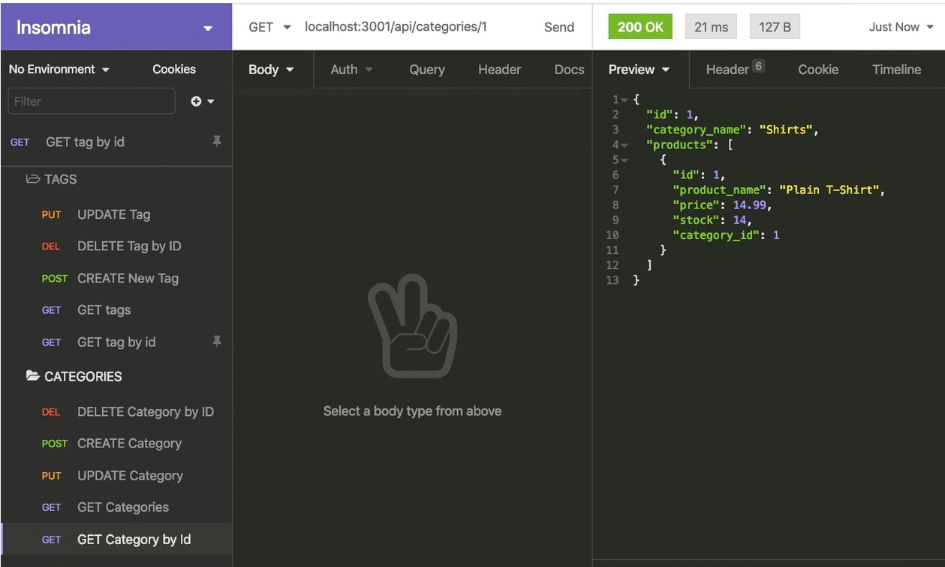

# E-commerce Back End Starter Code
## Description

This is the back end for an e-commerce site. A functional Express.js API was configured to use Sequelize to interact with a MySQL database.

## Installation

App uses dotenv, MySQL2, and sequalize packages-- npm i, npm run seed, then npm run start to run app.

## Usage
-Given a functional Express.js API, when user adds database name, MySQL username, and MySQL password to an environment variable file, then user can connect to a database using Sequelize.
When user enters schema and seed commands, then a development database is created and is seeded with test data.
When user enters the command to invoke the application, then my server is started and the Sequelize models are synced to the MySQL database.
WHEN I open API GET routes in Insomnia Core for categories, products, or tags
THEN the data for each of these routes is displayed in a formatted JSON.
WHEN I test API POST, PUT, and DELETE routes in Insomnia Core
THEN I am able to successfully create, update, and delete data in my database.
 App functionality will resemble this image:

 
 
## License
N/A
## Link to github repository:
https://github.com/AnaCampos171/Ecommerce

## Link to a video walkthrough demonstrating app functionality: 
https://drive.google.com/file/d/1TZW1u9rmdifXz78wDJzy4ab8Lpg6IS2B/view

